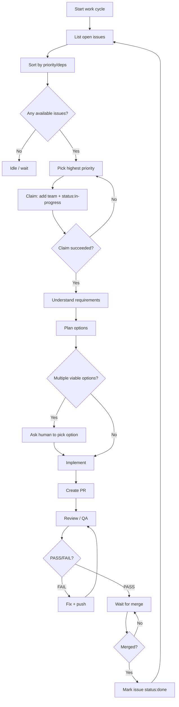

---
description: Turnkey GitHub Issues workflow (triage → plan → PR → review → merge)
---

# GitHub Issues Workflow

## Goal
Provide a repeatable, out-of-the-box workflow for turning GitHub Issues into shipped code changes with clear planning, ownership, and review loops.

## Prerequisites

### Tools
- `gh` installed and authenticated (`gh auth status`)

### Target repository
This workflow is configured to run against:

- GitHub repo: `fractalmind-ai/agent-manager-skill`
- Local path (recommended): `workspace/agent-manager-skill`

### Workspace setup (recommended)
Clone the target repository as a **git submodule** under `workspace/` so agents can work on code locally:

```bash
# from the oh-my-code repo root
mkdir -p workspace

# clone the target repo as a submodule
git submodule add "git@github.com:fractalmind-ai/agent-manager-skill.git" "workspace/agent-manager-skill"
git submodule update --init --recursive
```

Then run work from the submodule directory when implementing:

```bash
cd workspace/agent-manager-skill
```

## Label Conventions (Recommended)

### Team ownership (avoid duplicate work)
Use exactly one `team:*` label to claim an issue.
- Example: `team:core`, `team:frontend`, `team:infra`

### Status tracking
- `status:in-progress`
- `status:blocked`
- `status:done`
- `status:awaiting-human-merge` (optional, for queues)

## Workflow



## Step-by-step Commands

### 1) Find work
```bash
gh issue list --repo "fractalmind-ai/agent-manager-skill" --state open
```

To focus on unclaimed issues (no `team:*` labels), use search:
```bash
gh search issues --repo "fractalmind-ai/agent-manager-skill" --state open --search "-label:team:*"
```

### 2) Claim an issue (recommended)
Pick an issue number, then claim it:
```bash
ISSUE_NUMBER=123
TEAM_LABEL="team:core"

gh issue edit "$ISSUE_NUMBER" --repo "fractalmind-ai/agent-manager-skill" \
  --add-label "$TEAM_LABEL" \
  --add-label 'status:in-progress'
```

If claiming fails (race with another team), pick another issue.

### 3) Understand → Plan (mandatory for non-trivial work)

#### Understand
- Summarize requirements, constraints, and acceptance criteria.
- Identify edge cases, risks, and test strategy.

#### Plan options
Use this structure:

**Option 1: <name>**
- Approach
- Pros/Cons
- Risk level
- Effort estimate

**Option 2: <name>**
- Approach
- Pros/Cons
- Risk level
- Effort estimate

**Recommendation**: Option X

#### Technical design review (required when design matters)
If the issue needs a technical design decision (multiple viable approaches, tradeoffs, migrations, risky changes):
1. Post the options + recommendation as an **Issue comment**.
2. Explicitly ask the human to pick an option (or approve the recommendation).
3. STOP and wait for a human reply before implementing.

Example (comment options on the Issue):
```bash
gh issue comment "$ISSUE_NUMBER" --repo "fractalmind-ai/agent-manager-skill" --body-file - <<'EOF'
Design options:

Option 1: <name>
- Approach:
- Pros/Cons:
- Risks:
- Effort:

Option 2: <name>
- Approach:
- Pros/Cons:
- Risks:
- Effort:

Recommendation: Option X because <reason>.

Question for human: Please reply with "Option 1" / "Option 2" (or edits) before I implement.
EOF
```

Newline reminder (important):
- If you pass multi-line text via `--body "line1\nline2"`, GitHub may show the literal `\n` instead of a line break.
- Prefer `--body-file` (as above) or `--editor` to preserve newlines reliably.

To check for the human reply:
```bash
gh issue view "$ISSUE_NUMBER" --repo "fractalmind-ai/agent-manager-skill" --comments
```

### 4) Implement → PR

Create a PR that links the issue:
```bash
gh pr create --repo "fractalmind-ai/agent-manager-skill" --fill --title "<title>" --body "Closes #$ISSUE_NUMBER"
```

Newline reminder (important):
- Avoid embedding `\n` in `--body "..."` / `--comment "..."` strings.
- Prefer `--body-file` for multi-line PR descriptions, e.g.:
  `gh pr create ... --body-file - <<'EOF'`

### 5) Review loop (PASS/FAIL)
Run quality gates in the repo you changed before calling it PASS:
```bash
# from oh-my-code repo root
bash scripts/quality-gates.sh --repo workspace/<repo>
```

For a quick checks snapshot:
```bash
gh pr view --repo "fractalmind-ai/agent-manager-skill" --json number,title,state,mergeable,reviewDecision,statusCheckRollup
```

### 6) Merge policy (human-only)

Agents (all `EMP_*`) MUST NOT merge PRs.
- Do not run `gh pr merge` (or any equivalent).
- Do not click “Merge” in the GitHub UI.
- When QA/review is PASS and checks are green: mark as waiting, notify the human owner, then stop.
- If there are already 3+ pending human merges (`status:awaiting-human-merge`), do not add another one; idle instead.

```bash
gh issue edit "$ISSUE_NUMBER" --repo "fractalmind-ai/agent-manager-skill" --add-label 'status:awaiting-human-merge'
```

### 7) Close the loop after merge
After PR is merged:
```bash
gh issue edit "$ISSUE_NUMBER" --repo "fractalmind-ai/agent-manager-skill" \
  --remove-label 'status:in-progress' \
  --add-label 'status:done'
```

## Output Contract (for agents)

Every work cycle update ends with:
1. **Summary** (1–3 bullets)
2. **Evidence** (exact commands run + outcomes)
3. **Files Changed** (paths)
4. **Risks/Assumptions**
5. **Next Step**

## Rule: Awaiting human merge cap (max 3)

Agents MUST keep the number of PRs waiting on a human merge/review capped at 3.
If the cap is reached, agents stop starting new work and can idle until the count drops.

Check the current queue size:
```bash
gh search issues --repo "fractalmind-ai/agent-manager-skill" --state open --label 'status:awaiting-human-merge' --json number --jq 'length'
```
